# Style transfer
This is tensorflow implementation of ['Multimodal Transfer: A Hierarchical Deep Convolutional Neural Network for Fast Artistic Style Transfer'](https://arxiv.org/abs/1612.01895) which generates stylized image in high resulution such as 1024 pixels.


## Download program
```
$ git clone https://github.com/fullfanta/multimodal_style_transfer.git
```


## Train
To train network, I use MS coco dataset.
```
$ cd real_time_style_transfer
$ sh get_coco.sh
```
- downloaded image is in 'data/train2014'.

For stylization, pretrained VGG16 is necessary.
```
$ sh get_vgg16.sh
```

Then training is *SIMPLE*.
```
$ python train.py
```
- If you have multiple GPU cards, use CUDA_VISIBLE_DEVICES to specify GPU card.
- Trained model is in summary.

During training, you can see generated images through tensorboard.
```
$ tensorboard --logdir=summary
```


### Freeze model
```
$ sh freeze.sh 10000
```
- parameter is iteration number among saved check point files.
- It generates pb file which contains weights as contant.


## Test
```
$ python stylize.py --model=models/starry_night.pb --input_image=test_images/jolie.jpg
```
- It generates hierarchical stylized images and save them to 'test_images/jolie_output_1.jpg', 'test_images/jolie_output_2.jpg', and 'test_images/jolie_output_3.jpg'. Their sizes are 256, 512 and 1024 in short edge.
- Parameters:
```
--model : freezed model path
--input_image : image file path to stylize
--hierarchical_short_edges : three short edge length to generate images. (default is 256, 512, 1024)
```

## Examples
|    | Input | Output(256px) | Output(512px) | Output(1024px) |
|----|-------|---------------|---------------|----------------|
|Angelina Jolie|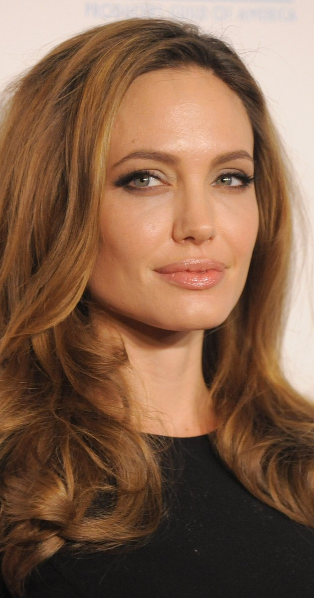|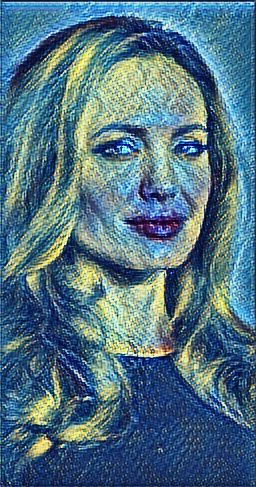|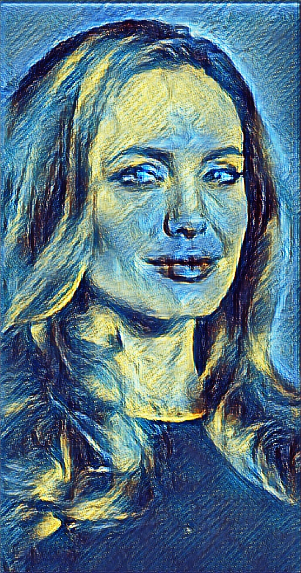|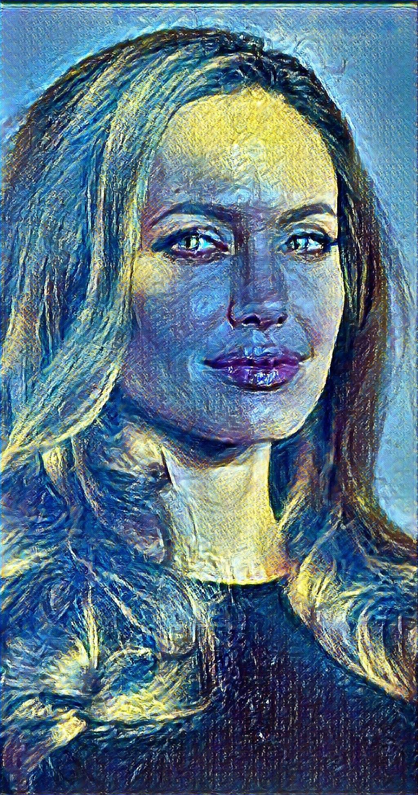|
|Dinosour|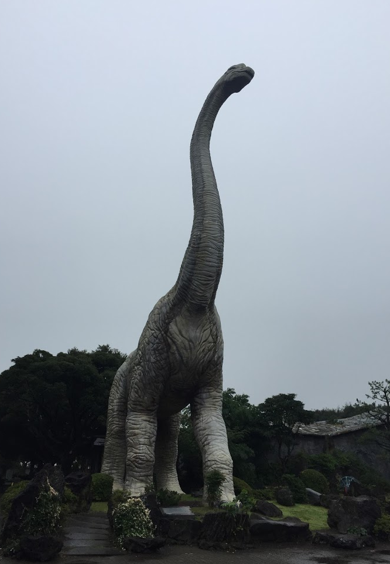|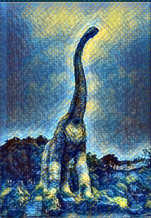|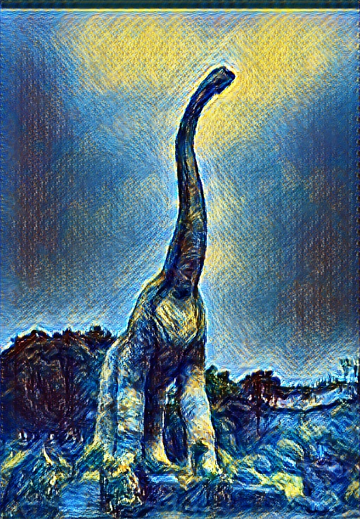|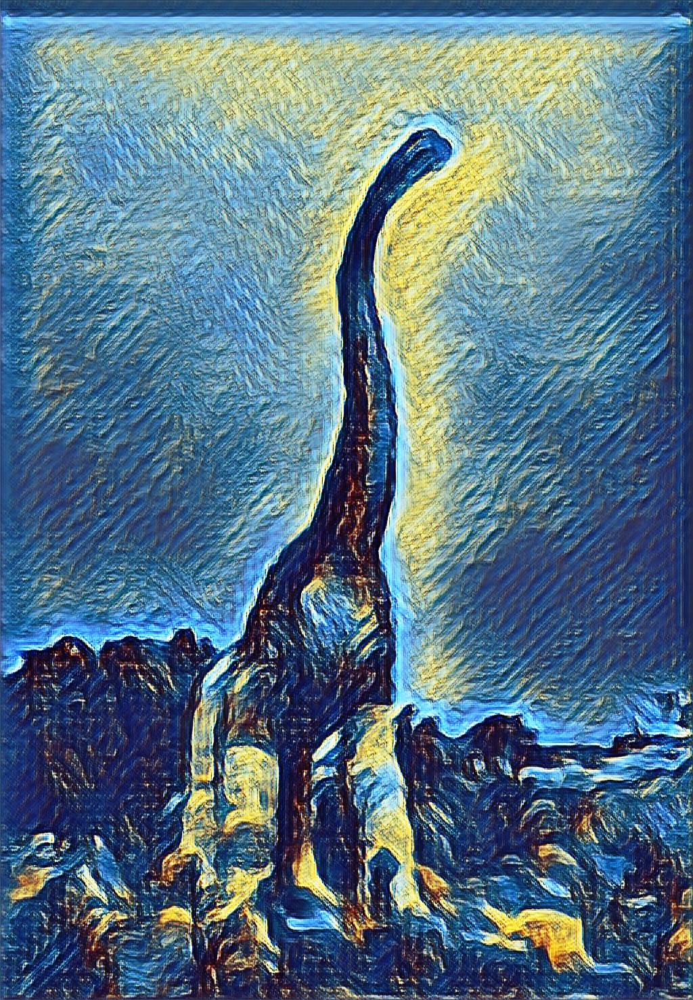|
|Ryan|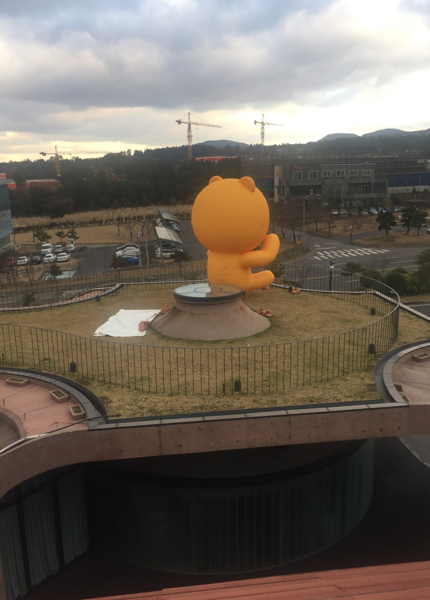|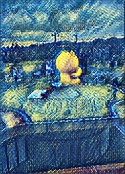|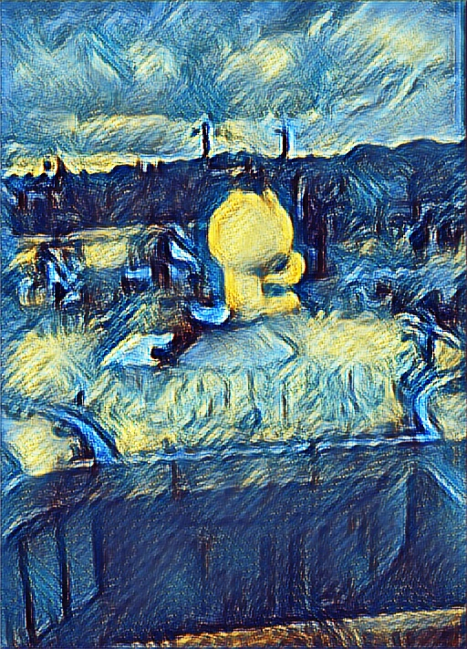|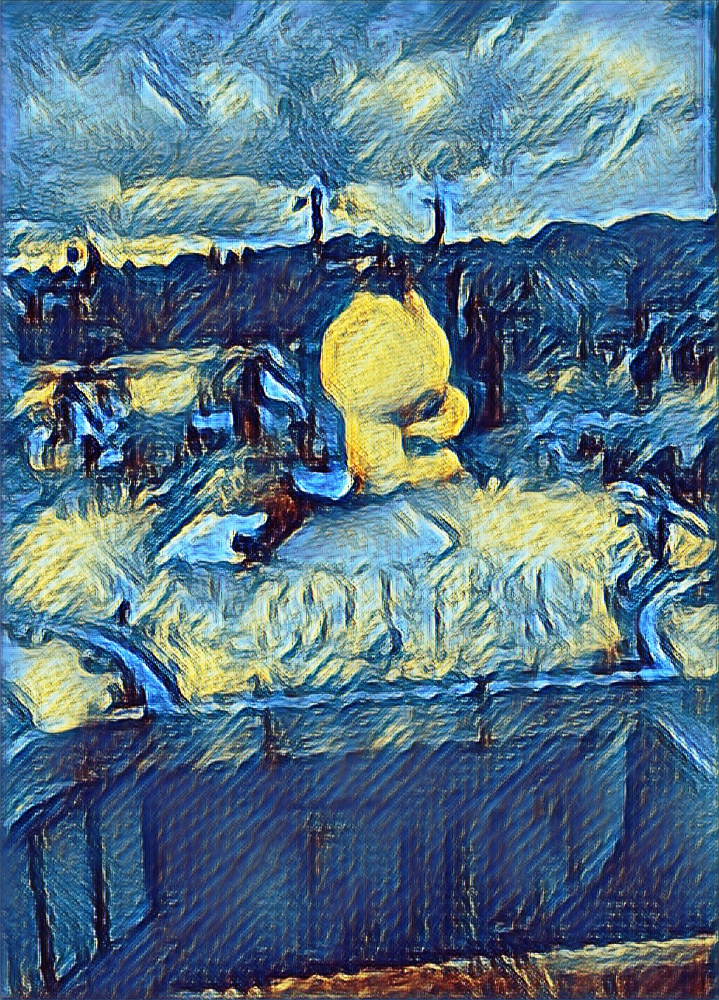|
|Cheez|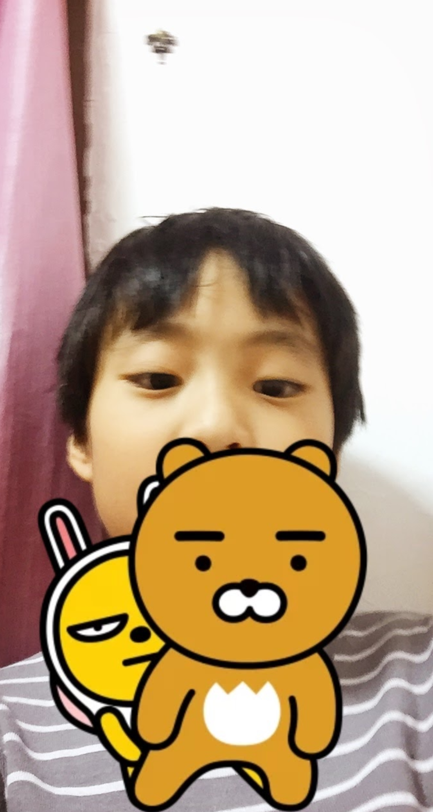|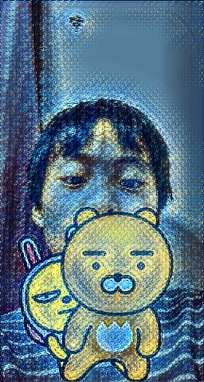|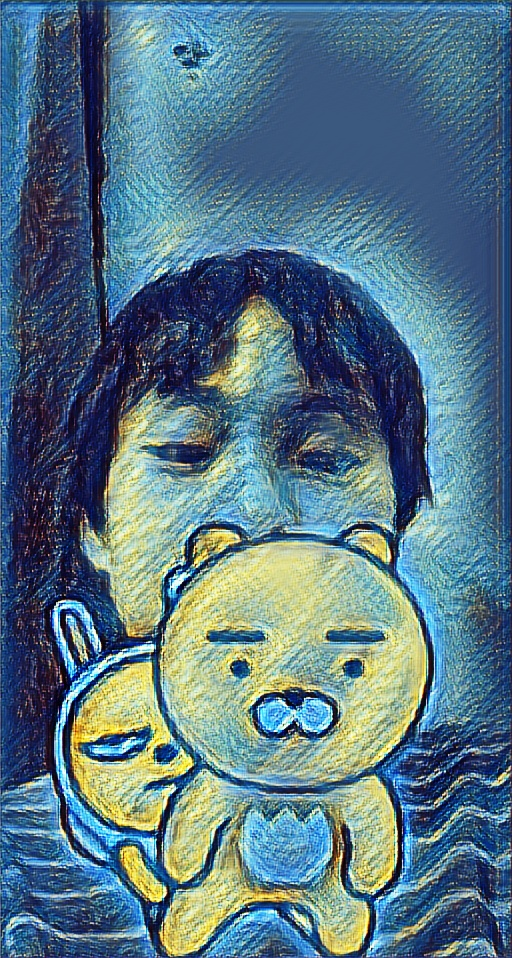|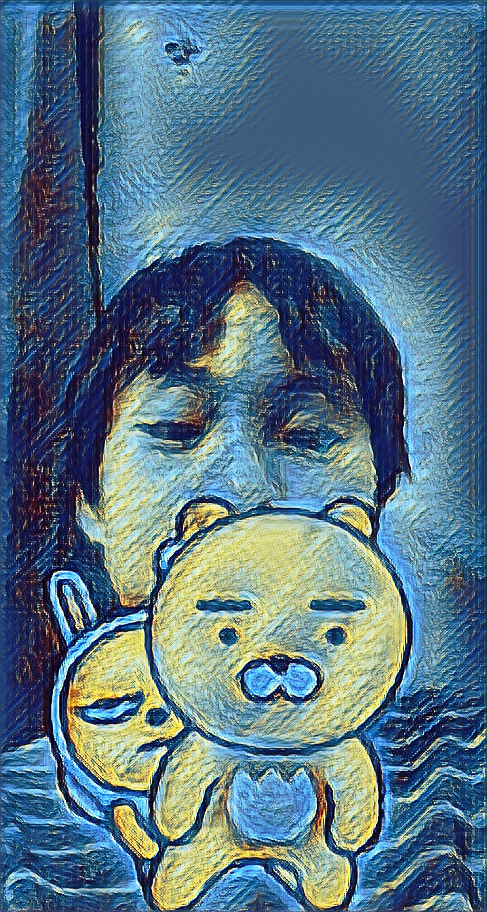|
|Herb||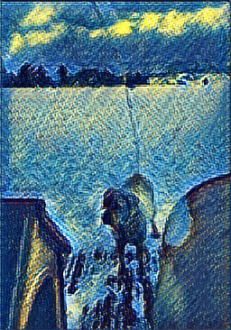|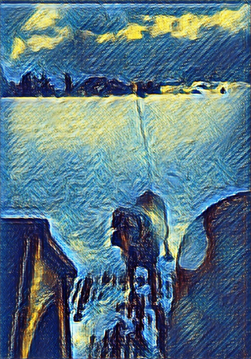|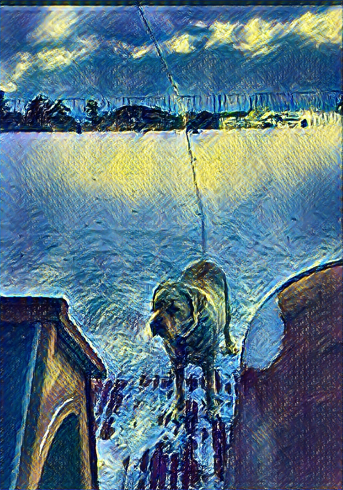|


## Acknowledgement
- For instance normalization, I refer 'https://github.com/ghwatson/faststyle'.
- For pretrained VGG16 network, I refer 'https://www.cs.toronto.edu/~frossard/post/vgg16/'.
